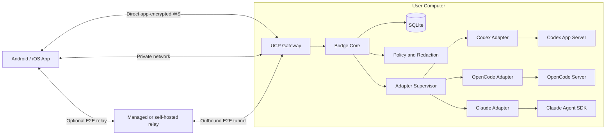

# Architecture

## 1. Architectural goal

Create a local-first system in which coding agents execute on the user's machine, while a mobile application provides a minimal and safe control surface. Optional hosted components improve remote reachability but are not a dependency for LAN/private-network operation.

## 2. System context



## 3. Mandatory and optional components

### Mandatory

- Mobile app
- Host bridge
- At least one runtime adapter
- Local persistence
- Authenticated pairing

### Optional

- Tailscale/private-network route
- Managed relay
- Product account
- Push gateway
- Self-hosted relay
- Cloud diagnostics

Core operation must not require any optional component.

## 4. Trust boundaries

### Mobile device

Trusted after pairing, but may be lost or compromised. Stores a device identity and minimal cached state.

### Host bridge

Primary trusted control component. It has access to runtime processes and normalized state but should not automatically gain more filesystem permission than the user account already has.

### Runtime

Authoritative for execution and native session state. Runtime-generated descriptive text is untrusted for security decisions.

### Relay

Untrusted for content confidentiality. It routes opaque encrypted frames and generic notification triggers.

### Local network

Untrusted. All direct communication requires cryptographic authentication and encrypted transport.

## 5. Host bridge internal architecture

```text
bridge-daemon
├── config manager
├── identity and pairing
├── UCP gateway
├── connection/session manager
├── command service
├── approval service
├── synchronization service
├── event journal
├── policy/redaction engine
├── notification outbox
├── adapter supervisor
│   ├── Codex worker
│   ├── OpenCode worker
│   └── Claude worker
└── diagnostics/observability
```

Adapters should ultimately run in worker processes or isolated child processes. The MVP may use in-process adapters behind strict interfaces, but the API boundary must permit later isolation.

## 6. Runtime-side transports

These are not the same as the phone-facing transport.

- Codex: JSON-RPC over stdio by default; Unix socket optional; app-server TCP WebSocket is experimental and not the preferred integration.
- OpenCode: localhost HTTP/OpenAPI plus SSE.
- Claude: Agent SDK `query()` streaming/session APIs inside the bridge process or adapter worker.

## 7. Phone-facing transport

Use a project-owned Universal Control Protocol over an authenticated, application-encrypted WebSocket. Direct LAN/private routes may use local `ws://` because every UCP frame is authenticated and encrypted; relay/public routes use `wss://` as an additional layer.

Reasons:

- Full-duplex foreground updates
- Straightforward mobile implementation
- Clear reconnect lifecycle
- Independent of runtime transport changes
- Supports direct and relayed modes

JSON is the v1 serialization. Binary frames are reserved for voice audio. MessagePack may be introduced only after profiling.

## 8. State ownership

| Layer | Authoritative responsibility |
|---|---|
| Runtime | Actual execution, tool result, model/session history |
| Bridge | Normalized mobile state, event sequence, mobile command ledger, paired devices |
| Relay | Connection routing and relay authorization only |
| Phone | Unsent drafts, display preferences, last acknowledged sequence |

The bridge cannot claim an action completed until the runtime confirms it or reconciliation proves it.

## 9. Persistence model

SQLite in WAL mode is the bridge persistence layer.

Persist:

- Paired devices and grants
- Runtime instances and capabilities
- Session mappings and snapshots
- Normalized event journal
- Command ledger
- Approval/question ledger
- Notification outbox
- Audit events

The phone uses secure storage for keys and SQLite for non-secret cached summaries.

## 10. Synchronization model

Each host emits a monotonically increasing event sequence.

On reconnect:

- Replay events after the phone's cursor when available.
- Otherwise provide a complete snapshot with a new watermark.
- The phone applies a snapshot transactionally.
- State-changing controls remain disabled until sync is complete.

Delivery is at-least-once. Idempotency and version checks make duplicate delivery safe.

## 11. Process lifecycle

### Bridge startup

1. Load configuration and identity.
2. Open and migrate database.
3. Mark nonterminal sessions unknown.
4. Start adapter supervisor.
5. Probe runtime versions.
6. Reconcile sessions and pending requests.
7. Start UCP gateway.
8. Start optional relay client.
9. Mark ready.

### Runtime failure

- Adapter reports degraded/offline.
- Existing session summaries stay visible as stale.
- Commands are rejected with `RUNTIME_OFFLINE`.
- Adapter restarts with bounded backoff.
- Reconciliation occurs before commands resume.

## 12. Runtime adapter boundary

The bridge core depends on a normalized `AgentAdapter` interface, not runtime libraries.

Adapters must provide:

- Probe and version
- Capabilities
- Session list/get/create/resume
- Send/steer/cancel
- Approval/question responses
- Event subscription
- Reconciliation

Unsupported operations return typed capability errors.

## 13. Optional MCP boundary

MCP is an extension layer, not the primary mobile protocol.

Possible bridge MCP server capabilities:

- List active sessions as resources
- Start/steer/cancel as tools
- Expose durable task handles
- Surface approval input requirements
- Invoke portable mobile-summary skills

Core runtime adapters continue to use the richest native runtime interface.

## 14. Deployment topology

### LAN-only

No vendor server. Phone connects directly to bridge.

### Private network

No vendor server. Phone connects through Tailscale/WireGuard addressing.

### Optional relay

Both phone and bridge establish outbound connections. Frames are end-to-end encrypted between phone and bridge.

## 15. Scalability targets

Initial single-host target:

- 100 visible sessions
- 20 active sessions
- 50 pending attention items
- 1,000 normalized events/minute burst
- Two to five paired devices

Do not introduce distributed databases or microservices into the bridge. The managed relay can be a separate horizontally scalable service.

## 16. Architecture invariants

1. Runtime credentials never go to the phone or relay.
2. The relay cannot decrypt UCP content.
3. Every state-changing command is idempotent.
4. Every approval uses optimistic concurrency.
5. Cached offline data is visibly stale.
6. Unknown runtime approval types fail closed.
7. Local operation remains usable without product servers.
8. Mobile UI renders capabilities rather than runtime assumptions.
9. The runtime remains authoritative for execution outcome.
10. Reconciliation precedes readiness after restart.
